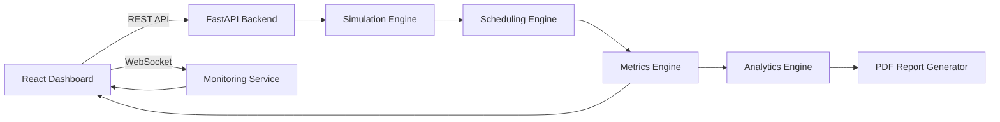

# Adaptive Cloud Resource Orchestrator (ACRO OS)

<p align="center">
  <strong>A Full-Stack Cloud Resource Scheduling and Operating System Analytics Platform</strong>
</p>

<p align="center">
  Simulate Cloud Workloads • Evaluate Scheduling Algorithms • Monitor Live System Resources • Analyze Performance
</p>

<p align="center">


</p>

---

## Overview

Adaptive Cloud Resource Orchestrator (ACRO OS) is a full-stack cloud resource scheduling and operating system analytics platform that combines configurable cloud infrastructure simulation with real-time operating system monitoring.

Unlike traditional scheduling simulators that evaluate algorithms using predefined workloads, ACRO OS enables users to create configurable cloud environments, generate dynamic workloads, execute multiple scheduling strategies, monitor live system resources, analyze scheduling performance, and generate comprehensive performance reports—all through a unified web interface.

The project bridges the gap between cloud simulation and live operating system analysis by integrating workload generation, adaptive scheduling, real-time monitoring, analytics, and reporting into a modular architecture that is both extensible and easy to experiment with.

---

## Live Demo

| Resource | URL |
|----------|-----|
| **Frontend (Vercel)** | https://acro-os.vercel.app |
| **Backend API (Render)** | https://acro-os.onrender.com |
| **GitHub Repository** | https://github.com/dhananjaiLN/ACRO-OS |

---

## Project at a Glance

| Property | Details |
|-----------|---------|
| **Project Type** | Full-Stack Systems Application |
| **Domain** | Cloud Computing • Operating Systems |
| **Frontend** | React, Vite, Tailwind CSS |
| **Backend** | FastAPI, Python |
| **Real-Time Communication** | WebSockets |
| **Simulation Engine** | Custom Tick-Based Cloud Simulation Engine |
| **Scheduling Algorithms** | FCFS, SJF, Priority, Round Robin, Multi-Level Feedback Queue (MLFQ), Adaptive Scheduler |
| **Monitoring** | Live CPU, Memory, Disk, Network and Process Monitoring |
| **Analytics** | Scheduler Comparison, Performance Metrics, Interactive Charts |
| **Reporting** | Automated PDF Report Generation |
| **Deployment** | Vercel + Render |

---

## Why ACRO OS?

Modern cloud infrastructures continuously process workloads with varying computational requirements. The effectiveness of a scheduling algorithm directly influences system throughput, waiting time, resource utilization, and overall performance.

Most educational scheduling simulators execute algorithms against static datasets and provide limited insight into how scheduling decisions affect a running system.

ACRO OS addresses this limitation by combining:

- Configurable cloud infrastructure simulation
- Dynamic workload generation
- Multiple scheduling algorithms
- Adaptive scheduler recommendation
- Live operating system monitoring
- Interactive analytics
- Automated report generation

This enables developers, students, and researchers to evaluate scheduling strategies under configurable cloud environments while simultaneously observing real operating system behaviour through live resource monitoring.

---

## Core Features

### Cloud Simulation

- Configurable host infrastructure
- Virtual machine lifecycle management
- Dynamic workload generation
- Multiple simulation scenarios
- Adjustable workload intensity
- Tick-based execution engine
- Resource allocation simulation

### Scheduling Engine

- First Come First Serve (FCFS)
- Shortest Job First (SJF)
- Priority Scheduling
- Round Robin
- Multi-Level Feedback Queue (MLFQ)
- Adaptive Scheduler Framework

### Live System Monitoring

- CPU utilization
- Memory utilization
- Disk usage
- Network activity
- Process monitoring
- Top resource-consuming processes
- Operating system information
- Continuous WebSocket updates

### Analytics & Reporting

- Waiting Time
- Turnaround Time
- Response Time
- Throughput
- CPU Utilization
- Scheduler Comparison
- Interactive Charts
- PDF Report Generation

---

## Technology Stack

| Layer | Technologies | Purpose |
|--------|--------------|---------|
| Frontend | React, Vite, Tailwind CSS, Axios, Recharts | Interactive dashboard and visualization |
| Backend | FastAPI, Python, Uvicorn | REST APIs, simulation engine, analytics |
| Simulation | Custom Tick-Based Engine | Cloud infrastructure modelling and workload execution |
| Scheduling | FCFS, SJF, Priority, Round Robin, MLFQ, Adaptive Scheduler | Workload scheduling and comparison |
| Monitoring | psutil | Live operating system monitoring |
| Real-Time Communication | WebSockets | Live resource updates |
| Reporting | ReportLab | PDF report generation |
| Deployment | Vercel, Render | Cloud deployment |

---

## Project Preview

> Screenshots of the dashboard, analytics, architecture view, live monitor, and generated reports will be added here.

| Dashboard | Analytics |
|-----------|-----------|
|  |  |

| Live Monitor | Architecture |
|--------------|--------------|
|  |  |

| PDF Report |
|------------|
|  |

---

## Table of Contents

- Overview
- Why ACRO OS?
- Core Features
- Technology Stack
- System Architecture
- Project Structure
- Installation
- Running Locally
- Running the Cloud Simulation
- Running Live System Monitoring
- Deployment
- Frontend Architecture
- Backend Architecture
- Request Lifecycle
- Simulation Pipeline
- Live Monitoring Pipeline
- Adaptive Scheduler
- Important Files
- Future Enhancements
- License

---

# System Workflow

ACRO OS follows a modular execution pipeline that transforms user-defined cloud configurations into scheduling insights and performance analytics.

```text
                  User Configuration
                          │
                          ▼
              Configure Cloud Environment
                          │
                          ▼
                Generate Cloud Workloads
                          │
                          ▼
            Execute Scheduling Algorithm
                          │
                          ▼
          Collect Execution & Resource Metrics
                          │
                          ▼
         Visualize Analytics & Live Monitoring
                          │
                          ▼
              Generate Performance Report
```

Each stage of the pipeline is designed as an independent module, allowing new scheduling algorithms, monitoring components, and analytics features to be integrated without affecting the rest of the system.

---

# System Architecture



The frontend communicates with the backend using REST APIs for simulation management and WebSockets for real-time monitoring. The backend orchestrates workload generation, scheduling, metrics collection, analytics, and report generation through a modular service architecture.

---

# Project Structure

```text
ACRO-OS/

├── backend/
│   ├── api/
│   ├── monitoring/
│   ├── scheduling/
│   ├── simulation/
│   ├── analytics/
│   ├── reports/
│   ├── models/
│   ├── utils/
│   └── main.py
│
├── frontend/
│   ├── src/
│   │   ├── pages/
│   │   ├── components/
│   │   ├── services/
│   │   ├── hooks/
│   │   ├── context/
│   │   └── assets/
│   │
│   └── public/
│
├── README.md
│
└── requirements.txt
```

---

# Getting Started

## Prerequisites

Before running ACRO OS locally, ensure the following software is installed.

| Software | Version |
|-----------|----------|
| Python | 3.11 or later |
| Node.js | 18 or later |
| npm | Latest |
| Git | Latest |

---

# Installation

Clone the repository.

```bash
git clone https://github.com/dhananjaiLN/ACRO-OS.git

cd ACRO-OS
```

---

## Backend Setup

Navigate to the backend directory.

```bash
cd backend
```

Create a virtual environment.

```bash
python -m venv venv
```

Activate the environment.

### Windows

```bash
venv\Scripts\activate
```

### Linux / macOS

```bash
source venv/bin/activate
```

Install the required dependencies.

```bash
pip install -r requirements.txt
```

Start the FastAPI server.

```bash
python -m uvicorn api.app:app --reload
```

The backend will be available at

```text
http://127.0.0.1:8000
```

Interactive API documentation:

```text
http://127.0.0.1:8000/docs
```

---

## Frontend Setup

Open another terminal.

```bash
cd frontend
```

Install dependencies.

```bash
npm install
```

Start the development server.

```bash
npm run dev
```

The frontend will be available at

```text
http://localhost:5173
```

---

# Running ACRO OS

Once both servers are running:

1. Open the frontend in your browser.
2. Configure the cloud infrastructure.
3. Select a scheduling algorithm.
4. Choose a workload scenario.
5. Start the simulation.
6. Observe workload execution.
7. Compare scheduling metrics.
8. Generate a PDF performance report.
9. Open the Live Monitor page to observe real system resource usage.

---

# Running Live System Monitoring

The Live Monitor continuously streams host operating system metrics using WebSockets.

The monitoring dashboard provides:

- CPU utilization
- Memory usage
- Disk utilization
- Network statistics
- Process information
- Operating system information
- Real-time charts

Unlike the simulation engine, the monitoring module collects live statistics directly from the host operating system, enabling users to compare simulated scheduling behaviour with actual system resource utilization.

---

# Deployment

The project is deployed using separate frontend and backend services.

| Component | Platform |
|-----------|----------|
| Frontend | Vercel |
| Backend | Render |

## Live Deployment

Frontend

```text
https://acro-os.vercel.app
```

Backend

```text
https://acro-os.onrender.com
```

For local development, update the frontend environment variables to point to your local FastAPI server.

---

# Frontend Architecture

The frontend is built as a modular React application that provides an interactive dashboard for configuring cloud simulations, visualizing scheduling performance, monitoring live system resources, and generating reports.

Rather than acting as a simple user interface, the frontend serves as the primary control center for the platform, communicating with the backend through REST APIs and WebSockets.

## Frontend Responsibilities

- Configure cloud simulation parameters
- Select scheduling algorithms
- Create workload scenarios
- Display scheduler performance metrics
- Visualize live operating system statistics
- Compare scheduling algorithms
- Generate downloadable reports
- Display system architecture

---

# Backend Architecture

The backend is implemented using FastAPI and follows a modular service-oriented architecture.

Each module is responsible for a single aspect of the platform, allowing components to evolve independently without affecting the rest of the system.

```text
                   FastAPI Backend

                          │

 ┌────────────┬────────────┬────────────┬────────────┐
 │            │            │            │            │
 ▼            ▼            ▼            ▼            ▼

Simulation  Scheduling  Monitoring  Analytics  Reporting
 Engine      Engine       Service      Engine      Engine
```

Each service exposes well-defined interfaces, making it straightforward to introduce new scheduling algorithms, monitoring providers, or reporting formats.

---

# Request Lifecycle

The following sequence illustrates what happens when a user starts a simulation.

```text
User
 │
 │ Configure Simulation
 ▼
React Dashboard
 │
 │ HTTP Request
 ▼
FastAPI Backend
 │
 ▼
Simulation Engine
 │
 ▼
Workload Generator
 │
 ▼
Scheduling Engine
 │
 ▼
Metrics Collector
 │
 ▼
Analytics Engine
 │
 ▼
JSON Response
 │
 ▼
React Dashboard
 │
 ▼
Charts & Tables
```

This request lifecycle separates simulation logic from presentation, ensuring that scheduling algorithms can evolve independently of the user interface.

---

# Simulation Pipeline

The simulation engine models a configurable cloud environment consisting of hosts, virtual machines, workloads, and scheduling policies.

Each simulation progresses through discrete execution ticks, allowing scheduling decisions to be evaluated over time.

```text
Simulation Configuration

        │

        ▼

Generate Hosts

        │

        ▼

Generate Virtual Machines

        │

        ▼

Create Workloads

        │

        ▼

Assign Scheduler

        │

        ▼

Tick-Based Execution

        │

        ▼

Collect Metrics

        │

        ▼

Generate Analytics
```

During every simulation tick, the scheduler evaluates the waiting queue, allocates resources, updates process states, and records execution metrics.

This design enables fair comparison between multiple scheduling algorithms under identical workload conditions.

---

# Live Monitoring Pipeline

In addition to cloud simulation, ACRO OS continuously monitors the host operating system.

Unlike the simulation engine, this module processes real system statistics collected from the host machine.

```text
Operating System

        │

        ▼

psutil

        │

        ▼

Monitoring Service

        │

        ▼

WebSocket

        │

        ▼

React Dashboard

        │

        ▼

Live Charts
```

The monitoring service periodically gathers:

- CPU utilization
- Memory utilization
- Disk usage
- Network statistics
- Running processes
- Operating system information

The collected metrics are streamed to connected clients using WebSockets, enabling real-time visualization without requiring manual page refreshes.

---

# Adaptive Scheduler

One of the primary objectives of ACRO OS is to compare traditional scheduling strategies with a custom adaptive scheduling approach.

Unlike conventional schedulers that rely on a single decision criterion, the Adaptive Scheduler evaluates multiple workload characteristics before selecting the next task for execution.

The scheduler considers factors such as:

- Process priority
- Waiting time
- Resource demand
- Workload intensity
- Current system utilization
- Fairness between virtual machines

Instead of applying a fixed scheduling policy, the Adaptive Scheduler dynamically adjusts scheduling decisions according to the characteristics of the current workload.

This enables the platform to demonstrate how adaptive scheduling techniques can improve responsiveness and resource utilization across varying cloud scenarios.

---

# Supported Scheduling Algorithms

| Algorithm | Description |
|-----------|-------------|
| FCFS | Executes workloads in arrival order. |
| SJF | Prioritizes workloads with the shortest execution time. |
| Priority Scheduling | Executes workloads according to assigned priority levels. |
| Round Robin | Shares CPU time fairly using configurable time slices. |
| Multi-Level Feedback Queue (MLFQ) | Dynamically adjusts process priority across multiple queues. |
| Adaptive Scheduler | Evaluates workload characteristics to recommend and execute the most appropriate scheduling strategy. |

---

# Important Files

| File / Module | Responsibility |
|---------------|----------------|
| `backend/main.py` | Starts the FastAPI application and registers all API routes. |
| `backend/simulation/` | Implements the tick-based cloud simulation engine. |
| `backend/scheduling/` | Contains scheduling algorithm implementations and execution logic. |
| `backend/monitoring/` | Collects live operating system metrics using `psutil`. |
| `backend/analytics/` | Computes scheduling metrics and comparative statistics. |
| `backend/reports/` | Generates downloadable PDF reports. |
| `frontend/src/pages/` | Dashboard pages for simulation, monitoring, analytics, and architecture. |
| `frontend/src/components/` | Reusable UI components used across the application. |
| `frontend/src/services/` | Handles REST API communication and WebSocket connections. |
| `frontend/src/hooks/` | Custom React hooks for state management and live updates. |

---

---

# Future Enhancements

The modular architecture of ACRO OS enables the platform to evolve into a more comprehensive cloud resource orchestration platform.

Potential future enhancements include:

- Kubernetes-inspired scheduling strategies
- Distributed multi-host simulation
- Container workload support
- SLA-aware scheduling
- Energy-efficient scheduling algorithms
- Machine learning-assisted scheduler recommendations
- Historical simulation replay
- Persistent simulation storage
- Multi-user authentication
- Cloud-native deployment support

---

## Author

**S Vishnu Dhananjai**

If you found this project interesting or have suggestions for improvement, feel free to open an issue or submit a pull request.
